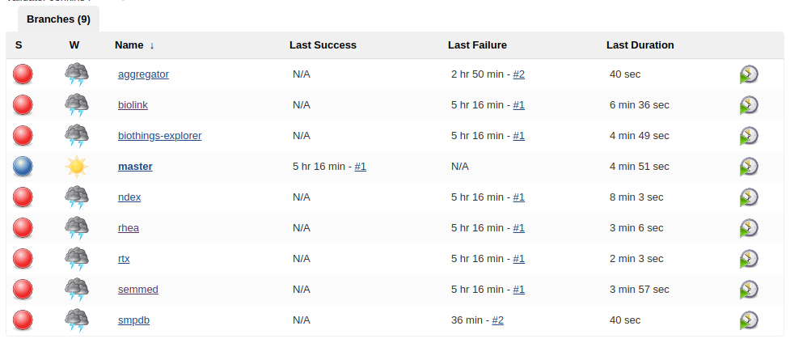

# Jenkins Validator for Knowledge Beacons

The [Knowledge Beacon](https://github.com/NCATS-Tangerine/translator-knowledge-beacon) is an API standard aimed at biomedical knowledge discovery. Particular beacons are web applications that implement this API, and provide a convenient common interface across multiple data sources. This system automates the testing of those beacons.

This github repo is a multi-branch Jenkins pipeline for running the validator project. Except for the master branch, each branch represents a testing pipeline and is configured slightly differently to run those tests (a git diff of branches may be useful to see those exact differences). The master branch does not run any tests and it should automatically pass.

After tests are finished, a HTML report is created and stored as an artifact.

The top level project contains files for setting up and running Jenkins. The inner `validator-project` directory contains a multi-project gradle build. Inside `validator-project`, the `validator` project contains the actual tests, and the `beacon-client` and `aggregator-client` contain two Swagger generated client projects for querying the beacons and the aggregator.

The tests can be run with the gradle wrapper at `validator-project/gradlew`. The beacon tests can be run like this:

```
./gradlew clean test -x :aggregator-client:test -x :beacon-client:test --tests "bio.knowledge.validator.beacon.*" --no-daemon
```

Tests for the beacon aggregator can be run like this:

```
./gradlew clean test -x :aggregator-client:test -x :beacon-client:test --tests "bio.knowledge.validator.aggregator.*" --no-daemon
```

#### Configuring tests

The beacon and aggregator URI's used in the test are set in `validator-project/validator/src/main/resources/application.properties`. Each branch should have these values set up. Since Jenkins doesn't run any tests in the master branch, these properties can be changed at whim in the master branch without effecting the behavior of Jenkins.

### Running Jenkins in Docker:

The root directory has files for automatically configuring the Jenkins instance when building and running the Docker container. To get started simply install Docker, build the container, and then run it.

Build the container:
```
docker build -t jenkins/validator .
```
Run the container:
```
docker run -u 0 -d --name='jenkins' -p 8080:8080 -p 50000:50000 -v `pwd`/jenkins_home:/var/jenkins_home jenkins/validator
```
Stop the container:
```
docker stop jenkins
```
Start the container:
```
docker start jenkins
```

The Makefile in the root directory offers some shorthand commands for convenience.

### Using Jenkins

The top view will look like this. Click on "jenkins-validator" to go further.


You will now see the job view. Each job corresponds to a branch in this repository with the same name. Other than the master branch, each branch is configured to query and test a beacon instance. Click on a job name to go further.



You will now be able to see the build history. The latest build is on top, and has the highest number. In this image there is only one build. Click the number to see the results of that build.


You will now be able to see the artifacts that this build has produced, i.e. the JUnit HTML test results. Click index.html to go to the main page. You will now be able to explore the test failures of this build.


